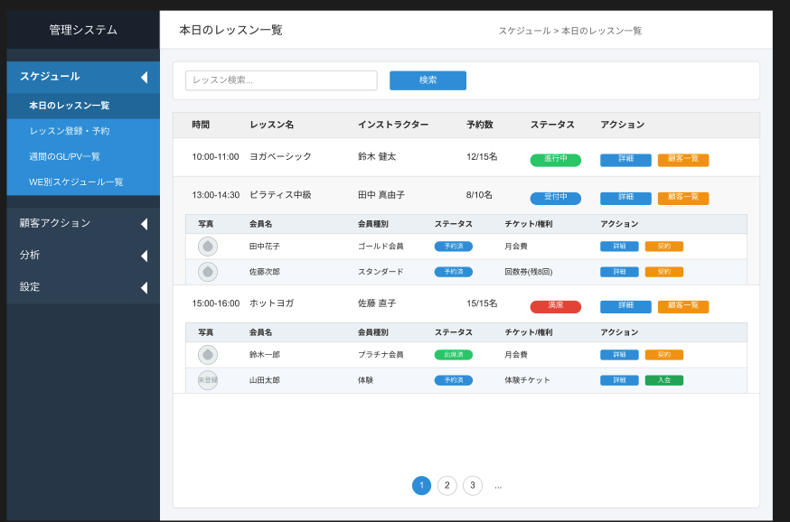

# フィットネススタジオ管理システム 要件定義書

## 1. システム概要
本システムはフィットネス/ヨガスタジオの管理者とインストラクターが、レッスンや予約状況を効率的に管理するためのWebアプリケーションである。画面に表示されている「本日のレッスン一覧」機能を実装する。

## 2. 開発環境要件

### 2.1 技術スタック
- フロントエンドフレームワーク: Next.js 15（App Router使用）
- スタイリング: TailwindCSS
- 言語: TypeScript 5.0以上
- テストフレームワーク: Jest + React Testing Library
- ビルドツール: デフォルト（Next.js組み込み）
- パッケージマネージャー: npm または yarn

### 2.2 環境構成
- Node.js: v18.0.0以上
- サポートブラウザ: 最新版のChrome, Firefox, Safari, Edge
- 開発環境: VS Code + Cursor AI推奨

### 2.3 プロジェクト構成
```
/
├── app/                   # Next.js App Router
│   ├── schedule/
│   │   └── today/
│   │       └── page.tsx   # レッスン一覧ページ
├── components/            # UIコンポーネント
│   ├── common/            # 共通コンポーネント
│   └── lesson/            # レッスン関連コンポーネント
├── data/                  # 静的データ
│   ├── lessons.json       # レッスンデータ
│   └── attendees.json     # 参加者データ
├── types/                 # TypeScript型定義
├── __tests__/            # テストファイル
├── tailwind.config.js     # TailwindCSS設定
└── next.config.js         # Next.js設定
```

## 3. 機能要件

### 3.1 本日のレッスン一覧表示機能
#### 3.1.1 機能概要

以下に本機能のUIイメージを示します。



- 管理者とインストラクターが本日開催される全レッスンを一覧で確認できること
- 各レッスンの予約状況をリアルタイムで把握できること
- レッスン参加者の情報を確認できること

#### 3.1.2 機能詳細
1. レッスン一覧表示
   - 表示項目：時間（例: "10:00-11:00"）、レッスン名、インストラクター名、予約数/定員数（例: "12/15名"）、ステータス、アクション
   - ステータスは「進行中」「受付中」「満席」の3種類で表示
   - ステータスに応じて色分け表示（進行中:緑、受付中:青、満席:赤）
   - アクションとして「詳細」ボタンと「顧客一覧」ボタンを表示

2. レッスン検索機能
   - 画面上部に検索ボックスを設置
   - レッスン名で検索可能
   - 検索結果は即時反映（リアルタイム検索）

3. 参加者一覧表示
   - 「顧客一覧」ボタンをクリックするとそのレッスンの参加者一覧を展開表示
   - 表示項目：会員写真（アバター）、会員名、会員種別、予約ステータス、チケット/特典情報、アクション
   - 会員種別は「ゴールド会員」「プラチナ会員」「スタンダード」「体験」の4種類
   - 予約ステータスは「予約済」「出席済」の2種類
   - チケット情報には「月会費」「回数券(残り回数)」「体験チケット」などを表示
   - アクションとして「詳細」と「処理」ボタンを表示

4. ページネーション
   - 表示レッスン数が多い場合、ページ分割して表示
   - ページ番号を表示し、クリックでページ移動可能
   - 前へ/次へボタンで隣接ページへ移動可能

## 4. 非機能要件

### 4.1 パフォーマンス
- 初期表示は3秒以内に完了すること
- ユーザー操作（検索、ページ切替など）のレスポンスは1秒以内

### 4.2 ユーザビリティ
- レスポンシブ対応（デスクトップ、タブレット、スマートフォン）
- 視認性の高いUI（ステータス表示は色分けし、ボタンは用途に応じて色分け）
- 操作性の向上（クリック領域の最適化、フィードバックの提供）

### 4.3 拡張性
- 将来的なレッスン種別やステータスの追加に対応可能な設計
- 多言語対応を見据えたテキスト管理
- データソースの差し替えが容易な構成（静的データから実APIへの移行）

### 4.4 テスト要件
- コンポーネント単位のユニットテスト（Jest + React Testing Library）
- 機能単位の統合テスト
- アクセシビリティテスト（WAI-ARIA準拠確認）

## 5. 制約条件

### 5.1 開発制約
- 初期フェーズでは静的JSONファイルをデータソースとして使用
- すべてのUIコンポーネントはTailwindCSSを使用してスタイリング
- コンポーネントは再利用可能な形で設計

### 5.2 技術的制約
- Next.jsのApp Routerを使用（Pages Routerは不使用）
- サードパーティライブラリは最小限に抑える
- TypeScriptの型定義を厳密に行い、型安全性を確保