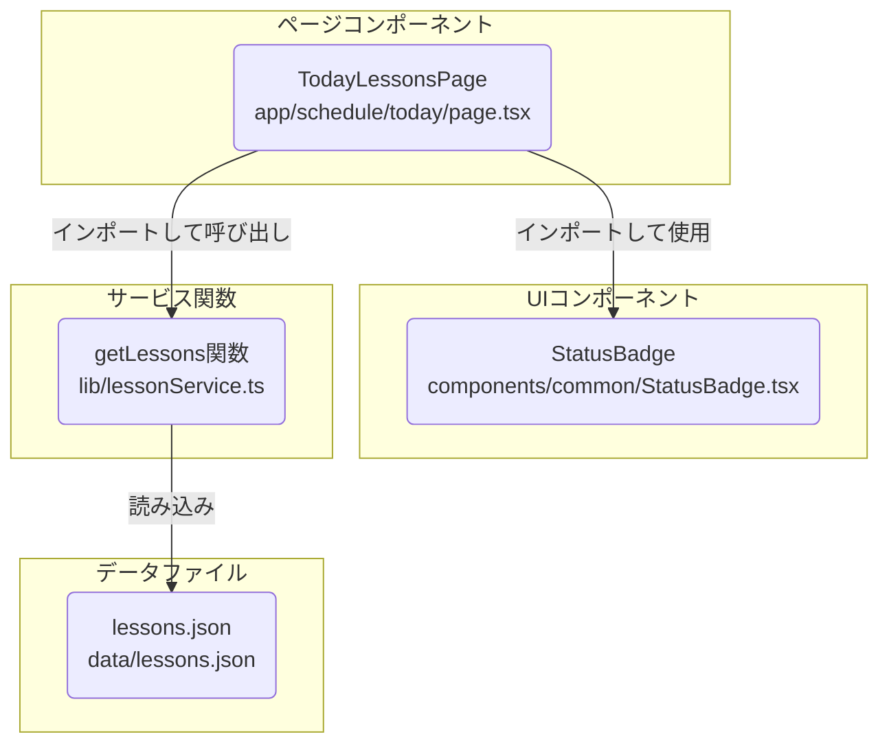

# フィットネススタジオ管理システム 基本設計書 (超最小デモ版)

## 1. 主要機能

### 1.1 レッスン一覧表示
- 表示項目：レッスン名、ステータス (UIイメージ参照)
- UI：シンプルなリスト形式（テーブルまたはdivベース）。ステータスは `StatusBadge` コンポーネントを使用し色分け。

## 2. コンポーネント構成

- **TodayLessonsPage** (`app/schedule/today/page.tsx`): メインページコンポーネント
  - レッスンデータの定義と状態管理 (オプションで状態変更も)
  - レッスン一覧のレンダリング、`StatusBadge` の利用。
- **StatusBadge** (`components/common/StatusBadge.tsx`): ステータス表示用共通コンポーネント
  - ステータス文字列に応じて適切な色とテキストを表示。

### 設計方針補足
本デモでは、最小構成であっても「データ取得処理（getLessons関数）」をサービス層（lib/lessonService.ts）に分離している。
これは、実際の業務開発での拡張性・保守性・テスト容易性を意識した設計であり、UI層はデータ取得方法の変更に依存しない形を目指している。
たとえば将来的にAPIやDB接続に切り替える場合も、getLessons関数の実装を差し替えるだけでUI側の修正を最小限にできる。
データ取得は必ずサービス層（getLessons関数）を経由し、サーバーコンポーネントからのみ行う。クライアントコンポーネントからの直接呼び出しは禁止とする。

## 3. 表示内容の確認 (開発者向け)
開発者は、本日のレッスン一覧画面 (`/schedule/today`) にアクセスし、以下の点を目視で確認する。
- `data/lessons.json` に定義されたレッスン情報（レッスン名、ステータス）が正しく表示されていること。
- 各レッスンのステータス表示が、`docs/02_基本設計/images/lesson_list_ui.png` のUIイメージおよび設計に沿った色分けで `StatusBadge` コンポーネントによって表示されていること。
- Webブラウザのコンソールにエラーが出力されていないこと。

## 4. ファイル・コンポーネント関連図 (Mermaid)

## 5. 運用・実装ルール

- ルーティングに関わるディレクトリ・ファイル名はNext.jsの規約に厳密に従うこと。typoや大文字小文字の違いに注意。
- 設計書のディレクトリ構造図と実際のファイル配置が常に一致していることをlsやfindコマンドで確認すること。
- 新規ページ追加時は、該当URLに即アクセスし404でないことを確認すること。
- Next.jsの開発サーバーは必ず1プロセスのみ起動し、複数プロセスが動作していないか定期的に確認すること。
- エラー発生時はまずキャッシュ削除（rm -rf .next）と再起動を行うこと。
- 作業前は必ず現在のディレクトリを確認し、パスの扱いに注意すること。
- 新しい機能実装時はシンプルさから始めること。
- 明確なルールとチェックリストで作業を進めること。