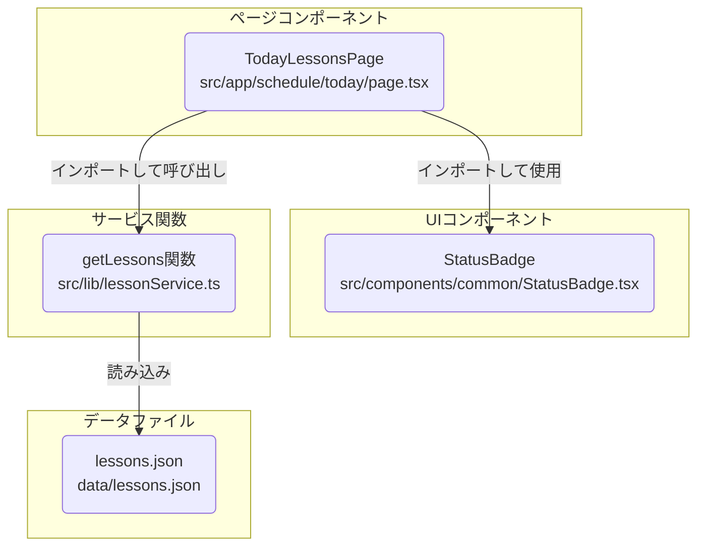

# フィットネススタジオ管理システム 基本設計書 (超最小デモ版)

## 1. 主要機能

### 1.1 レッスン一覧表示
- 表示項目：レッスン名、ステータス (UIイメージ参照)
- UI：シンプルなリスト形式（テーブルまたはdivベース）。ステータスは `StatusBadge` コンポーネントを使用し色分け。

## 2. コンポーネント構成

- **TodayLessonsPage** (`app/schedule/today/page.tsx`): メインページコンポーネント
  - レッスンデータの定義と状態管理 (オプションで状態変更も)
  - レッスン一覧のレンダリング、`StatusBadge` の利用。
- **StatusBadge** (`components/common/StatusBadge.tsx`): ステータス表示用共通コンポーネント
  - ステータス文字列に応じて適切な色とテキストを表示。

## 3. 表示内容の確認 (開発者向け)
開発者は、本日のレッスン一覧画面 (`/schedule/today`) にアクセスし、以下の点を目視で確認する。
- `data/lessons.json` に定義されたレッスン情報（レッスン名、ステータス）が正しく表示されていること。
- 各レッスンのステータス表示が、`docs/02_基本設計/images/lesson_list_ui.png` のUIイメージおよび設計に沿った色分けで `StatusBadge` コンポーネントによって表示されていること。
- Webブラウザのコンソールにエラーが出力されていないこと。

## 4. ファイル・コンポーネント関連図 (Mermaid)

